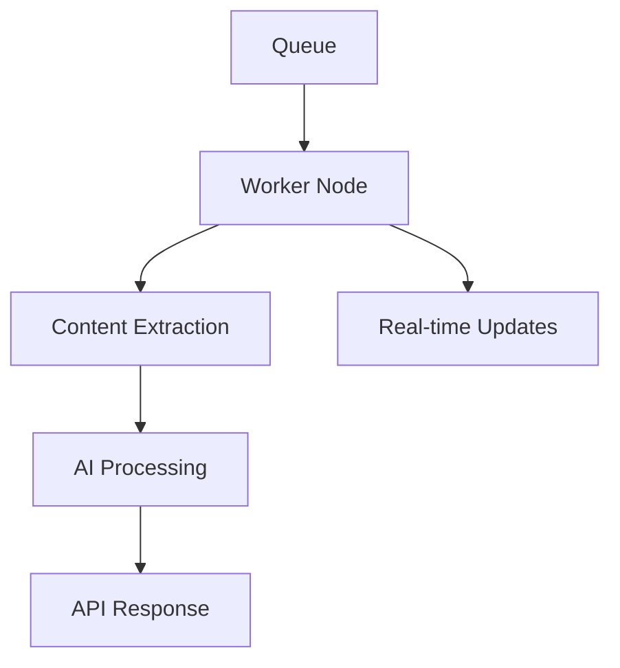

# Web Reader Worker 🚀

A high-performance, scalable web content extraction service built with modern TypeScript and Node.js. This service intelligently processes web pages, extracts meaningful content, and provides clean, structured data through an AI processing pipeline.

## 🏗 Architecture



## 🌟 Key Features

- **Intelligent Content Extraction**
  - Advanced DOM traversal algorithms
  - Smart text density analysis
  - Automatic article detection
  - Link preservation and reference mapping

- **Multi-Format Output**
  - Clean HTML
  - Markdown conversion
  - Readability-optimized text
  - Structured JSON responses

- **Real-time Processing**
  - Socket.IO-based live updates
  - Progress streaming
  - System resource monitoring
  - Neomorphic UI

- **Scalable Architecture**
  - Horizontal scaling ready
  - Queue-based processing
  - Configurable worker nodes
  - REST API integration

## 🛠️ Technology Stack

- **Core**: TypeScript, Node.js
- **Browser Automation**: Playwright
- **Content Processing**: Mozilla Readability, Turndown
- **Real-time Communication**: Socket.IO
- **UI**: Custom Neomorphic Design
- **AI Integration**: LangChain, OpenAI GPT-4, Ollama

## 🚀 Getting Started

1. **Clone and Install**
```bash
git clone https://github.com/yourusername/web-reader-worker.git
cd web-reader-worker
npm install
```

2. **Configure Environment**
```bash
cp .env.example .env
# Edit .env with your settings:
# - CORE_HOST: API host
# - CORE_PORT: API port
# - CORE_API_KEY: Your API key
# - CHROME_EXECUTABLE_PATH: Path to Chrome
# - OPENAI_API_KEY: Your OpenAI key
```

3. **Build and Run**
```bash
npm run build  # Builds the project
npm run serve  # Runs the server
npm run dev    # Runs in development mode with hot reload
```

## 🎯 Use Cases

- Custom data extraction
- Custom data processing
- Custom data analysis
- Custom data visualization

## 📈 Performance

- Processes pages in milliseconds
- Handles complex DOM structures
- Efficient memory management
- Real-time progress updates
- Scalable to thousands of pages

## 🔍 Key Components

- **DOM Worker**: Intelligent content extraction
- **Field Processor**: Configurable field extraction
- **Socket Integration**: Real-time updates
- **Neomorphic UI**: Modern, clean interface
- **LLM Integration**: AI-powered content analysis

## 🛡️ Security

- Environment-based configuration
- API key authentication
- Secure WebSocket connections
- Sanitized content processing

## 🤝 Contributing

Dont break it
Improve it
Respect security
Consider scalability

## 📄 License

.....

## 🌟 Acknowledgments

- Mozilla Readability Team
- Playwright Contributors
- LangChain Community

---

<p align="center">
Started with ⚡ by NoWayJA
</p>
